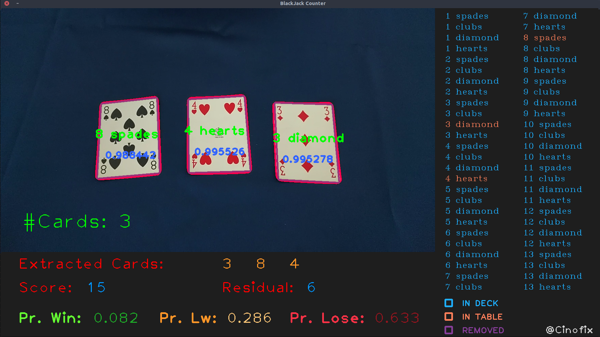

# Computer vision project: BlackJack counter #
The final project consists in the development of a software to assist the user when playing the card game “BlackJack”. You’ll have to create a C++ program (using the OpenCV library)
to process frames from either a video file or webcam and automatically identify the playing cards that are visible during the game. This information is used to infer the probability of
winning or losing the game when a new card is drawn.

### Features
The program analyze the video frames sequentially and, for each frame, give the following output:

 * The status of each card, which can be either: “In the deck”, “on the table” or “removed”. Once a card changes its status from “in the deck” to “on the table”, it cannot go back to the previous state. Similarly, the state change from “on the table” to “removed” is irreversible. When the program starts, all the cards are “in the deck”
 * The total rank of all the cards “on the table”
 * The probability that the total rank of all the cards on the table will be less than 21 when a new card is drawn and placed on the table
 * The probability of winning the game when the next card is drawn (ie the total rank of all the cards that will be on the table is exactly equal to 21)
 * The probability of losing the game when the next card is drawn (ie the total rank of all the cards that will be on the table is greater than 21)

### Build and Run
How to build:

``` bash
$ mkdir build
$ cd build
$ cmake ../ -DOpenCV_DIR="<insert the path of your opencv/build directory>"
$ make
```

How to run:
``` bash
$ cd build
$ make run
```


or, alternatively:

``` bash
$ make install
$ cd dist/bin
```

and run the generated executable


### Test
In order to test the project you can download two videos from [here](https://drive.google.com/open?id=19fvbBKRVqZxKM8-tuuowb-8kbMRvVJsr) and put them in the `test` folder. 
<p align="center"> 

</p>

### Contacts
If you have any doubts about the project do not hesitate to write me an e-mail:  854866[at]stud[dot]unive[dot]it | acina04[at]gmail[dot]com
